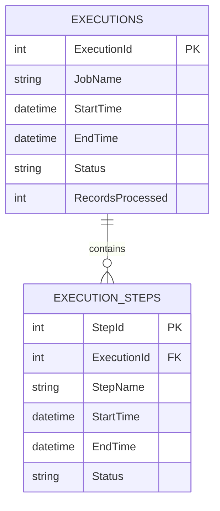
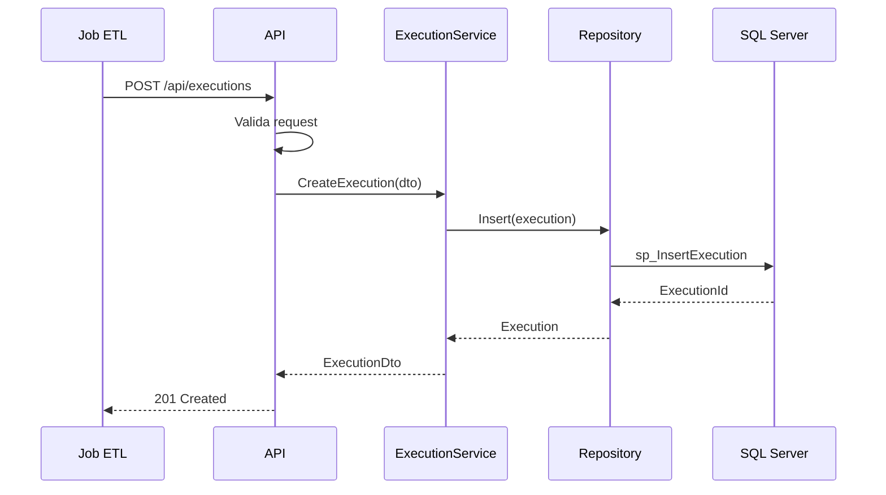
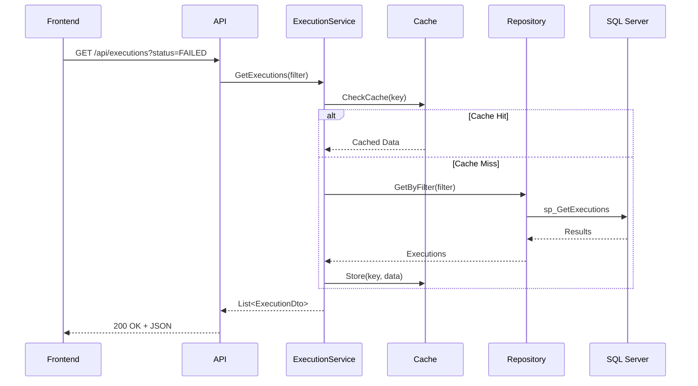

# 🏗️ Arquitetura do DataPulseCM

Entenda a estrutura e as tecnologias por trás do DataPulseCM.

## 📐 Visão Geral

O DataPulseCM segue os princípios de **Clean Architecture**, garantindo:
- Separação clara de responsabilidades
- Código testável e manutenível
- Baixo acoplamento entre camadas
- Facilidade para evolução e mudanças

```
DataPulseCM/
├── API (.NET 9.0)           # Backend REST API
├── Frontend (React + TS)     # Dashboard Web
├── Database (SQL Server)     # Armazenamento de dados
└── Logging (Serilog + Seq)   # Sistema de logs
```

## 🎯 Camadas da Aplicação

### 1. API Layer (Apresentação)
**Responsabilidade:** Expor endpoints REST e receber requisições HTTP

**Tecnologias:**
- ASP.NET Core Web API
- Controllers e Minimal APIs
- Swagger/OpenAPI para documentação
- FluentValidation para validação de entrada

**Estrutura:**
```
EtlMonitoring.Api/
├── Controllers/
│   ├── ExecutionsController.cs
│   ├── JobsController.cs
│   └── HealthController.cs
├── Validators/
│   └── CreateExecutionValidator.cs
├── Middleware/
│   └── ErrorHandlingMiddleware.cs
└── Program.cs
```

### 2. Application Layer (Casos de Uso)
**Responsabilidade:** Lógica de negócio e orquestração

**Padrões utilizados:**
- CQRS (Command Query Responsibility Segregation)
- Repository Pattern
- Dependency Injection

**Estrutura:**
```
EtlMonitoring.Application/
├── Services/
│   ├── ExecutionService.cs
│   └── JobService.cs
├── Interfaces/
│   └── IExecutionRepository.cs
├── DTOs/
│   ├── ExecutionDto.cs
│   └── CreateExecutionRequest.cs
└── Mappers/
    └── ExecutionMapper.cs
```

### 3. Infrastructure Layer (Dados e Externos)
**Responsabilidade:** Acesso a dados e serviços externos

**Tecnologias:**
- Dapper (Micro-ORM performático)
- SQL Server
- Serilog para logging estruturado

**Estrutura:**
```
EtlMonitoring.Infrastructure/
├── Repositories/
│   └── ExecutionRepository.cs
├── Data/
│   └── DbContext.cs
└── Logging/
    └── LoggingConfiguration.cs
```

### 4. Domain Layer (Entidades)
**Responsabilidade:** Modelos de domínio e regras de negócio

**Estrutura:**
```
EtlMonitoring.Domain/
├── Entities/
│   ├── Execution.cs
│   ├── ExecutionStep.cs
│   └── Job.cs
└── Enums/
    └── ExecutionStatus.cs
```

## 🗄️ Modelo de Dados

### Principais Tabelas

#### Executions (Execuções)
Armazena informações sobre cada execução de job ETL.

```sql
CREATE TABLE Executions (
    ExecutionId INT PRIMARY KEY IDENTITY,
    JobName NVARCHAR(100) NOT NULL,
    StartTime DATETIME2 NOT NULL,
    EndTime DATETIME2,
    Status NVARCHAR(20) NOT NULL,
    RecordsProcessed INT,
    ErrorMessage NVARCHAR(MAX),
    CreatedAt DATETIME2 DEFAULT GETDATE()
);
```

**Campos principais:**
- `JobName`: Nome do job ETL
- `Status`: SUCCESS, FAILED, RUNNING
- `RecordsProcessed`: Quantidade de registros processados
- `ErrorMessage`: Mensagens de erro (se houver)

#### ExecutionSteps (Etapas de Execução)
Detalha cada step dentro de uma execução.

```sql
CREATE TABLE ExecutionSteps (
    StepId INT PRIMARY KEY IDENTITY,
    ExecutionId INT FOREIGN KEY REFERENCES Executions(ExecutionId),
    StepName NVARCHAR(100) NOT NULL,
    StartTime DATETIME2 NOT NULL,
    EndTime DATETIME2,
    Status NVARCHAR(20) NOT NULL,
    Message NVARCHAR(MAX)
);
```

### Relacionamentos



## 🔄 Fluxo de Dados

### Registro de Nova Execução



### Consulta de Execuções



## 🎨 Frontend Architecture

### Estrutura de Componentes

```
frontend/
├── src/
│   ├── components/
│   │   ├── Dashboard/
│   │   │   ├── StatsCards.tsx
│   │   │   └── ExecutionsTable.tsx
│   │   ├── ExecutionDetail/
│   │   │   ├── ExecutionInfo.tsx
│   │   │   └── StepsTimeline.tsx
│   │   └── common/
│   │       ├── Loading.tsx
│   │       └── ErrorBoundary.tsx
│   ├── services/
│   │   └── api.ts
│   ├── hooks/
│   │   ├── useExecutions.ts
│   │   └── usePolling.ts
│   ├── types/
│   │   └── execution.types.ts
│   └── App.tsx
```

### Tecnologias Frontend

**React 19 + TypeScript:**
- Componentes funcionais com Hooks
- Type safety completo
- Props e state tipados

**Material-UI (MUI):**
- Componentes prontos e customizáveis
- Design system consistente
- Responsivo por padrão

**React Router:**
- Navegação SPA
- Rotas dinâmicas
- History management

**Axios:**
- Cliente HTTP
- Interceptors para autenticação
- Error handling centralizado

**Recharts:**
- Gráficos interativos
- Visualização de métricas
- Responsivo

## 🔐 Segurança (Roadmap)

Funcionalidades planejadas:

- **Autenticação JWT**
  - Login via API
  - Tokens de acesso e refresh
  
- **Autorização baseada em roles**
  - Admin: acesso total
  - Viewer: apenas leitura
  
- **HTTPS obrigatório**
  - Certificados SSL/TLS
  - Redirecionamento automático

- **Rate Limiting**
  - Proteção contra abuso
  - Limites por IP e usuário

## 📊 Monitoramento e Observabilidade

### Logging com Serilog

```csharp
Log.Information("Execution {ExecutionId} started for job {JobName}", 
    executionId, jobName);

Log.Error(exception, "Failed to process execution {ExecutionId}", 
    executionId);
```

**Structured Logs:**
- JSON format
- Contextual information
- Correlação de requisições

### Health Checks

```csharp
builder.Services.AddHealthChecks()
    .AddSqlServer(connectionString)
    .AddCheck<ApiHealthCheck>("api")
    .AddCheck<ExternalServicesCheck>("external");
```

**Endpoints:**
- `/health` - Status geral
- `/health/ready` - Pronto para receber tráfego
- `/health/live` - Aplicação está viva

### Application Insights (Futuro)

- Métricas de performance
- Rastreamento de dependências
- Analytics e dashboards

## 🚀 Performance

### Otimizações Implementadas

**Backend:**
- Dapper ao invés de EF Core (3-4x mais rápido)
- Stored Procedures otimizadas
- Índices no banco de dados
- Async/await em todas operações I/O

**Frontend:**
- Code splitting com React.lazy
- Memoização de componentes pesados
- Debounce em filtros
- Paginação server-side

**Database:**
```sql
-- Índices para performance
CREATE INDEX IX_Executions_JobName_StartTime 
    ON Executions(JobName, StartTime DESC);

CREATE INDEX IX_Executions_Status 
    ON Executions(Status) 
    INCLUDE (JobName, StartTime, EndTime);
```

## 📈 Escalabilidade

### Estratégias para Crescimento

**Horizontal Scaling:**
- API stateless (permite múltiplas instâncias)
- Load balancer (Nginx, Azure Load Balancer)
- Sessões em cache distribuído (Redis)

**Vertical Scaling:**
- Aumento de recursos do servidor
- Otimização de queries
- Índices adicionais

**Database Scaling:**
- Particionamento de tabelas por data
- Read replicas para consultas
- Arquivamento de dados antigos

## 🧪 Testabilidade

A arquitetura facilita testes em todos os níveis:

**Unit Tests:**
```csharp
[Fact]
public void CreateExecution_ValidData_ReturnsExecution()
{
    // Arrange
    var mockRepo = new Mock<IExecutionRepository>();
    var service = new ExecutionService(mockRepo.Object);
    
    // Act & Assert
    ...
}
```

**Integration Tests:**
- Testes com banco in-memory
- Testes de API com WebApplicationFactory

**E2E Tests:**
- Cypress para frontend
- Playwright para fluxos completos

## 📚 Próximos Passos

- [**API Reference**](./api) - Explore todos os endpoints
- [**Exemplos**](./exemplos) - Veja o sistema em ação
